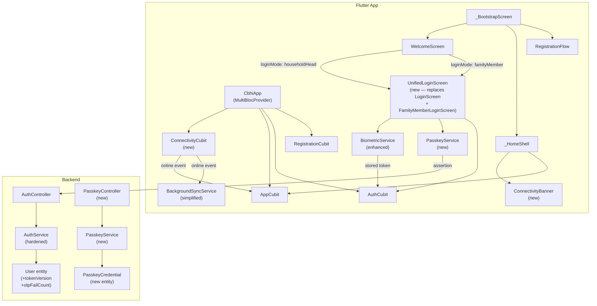
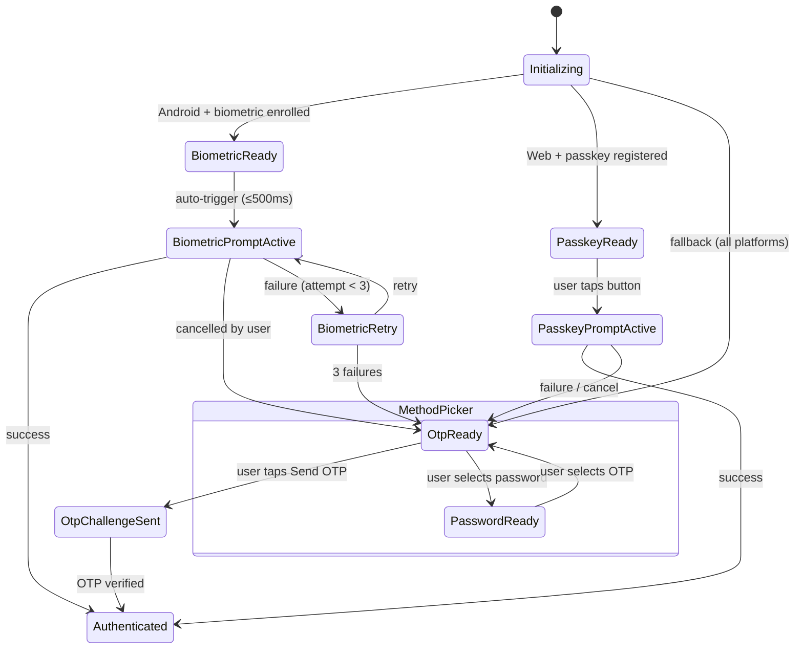

# Design Document — Member App UX Overhaul

## Overview

This document describes the technical design for the `member-app-ux-overhaul` feature, which addresses four interconnected problems in the `member_based_cbhi` Flutter app:

1. **UI inconsistency** — screens not applying `AppTheme` design tokens uniformly
2. **Navigation workflow clarity** — ambiguous auth entry points and back-navigation semantics
3. **Connectivity detection** — no real-time offline/online indicator for users
4. **Fragmented authentication** — three separate login screens with no unified entry, no passkey support on web, and buried biometric auth

The overhaul introduces `ConnectivityCubit`, `ConnectivityBanner`, `UnifiedLoginScreen`, `PasskeyService`, and security hardening across the NestJS backend. All changes must compile cleanly for both Android and Flutter Web (Vercel / dart2js).

---

## Architecture

### Component Interaction Diagram



### Key Architectural Decisions

- **ConnectivityCubit is the single source of truth** for online/offline status. `BackgroundSyncService` is simplified to a plain callback registry; `ConnectivityCubit` drives it instead of the service owning its own stream subscription.
- **UnifiedLoginScreen** uses a `LoginMode` enum and an `AdaptiveAuthMethod` enum to drive its UI state machine, keeping all auth paths in one widget tree.
- **PasskeyService** uses Dart conditional imports (`dart:js_interop` on web, stub on mobile) — the same pattern already used by `BiometricService`.
- **AppCubit** listens to `ConnectivityCubit` via a `BlocListener` in `_HomeShell` (not via a direct dependency) to trigger sync on reconnect, keeping cubits decoupled.

---

## Components and Interfaces

### 1. ConnectivityCubit

**File:** `lib/src/shared/connectivity_cubit.dart`

```dart
enum ConnectivityStatus { online, offline, unknown }

class ConnectivityState extends Equatable {
  const ConnectivityState({
    required this.isOnline,
    required this.status,
  });

  factory ConnectivityState.unknown() =>
      const ConnectivityState(isOnline: false, status: ConnectivityStatus.unknown);

  final bool isOnline;
  final ConnectivityStatus status;

  @override
  List<Object?> get props => [isOnline, status];
}

class ConnectivityCubit extends Cubit<ConnectivityState> {
  ConnectivityCubit() : super(ConnectivityState.unknown());

  StreamSubscription<List<ConnectivityResult>>? _subscription;

  Future<void> initialize() async {
    // 1. Check current state immediately
    final results = await Connectivity().checkConnectivity();
    _emitFromResults(results);

    // 2. Subscribe to changes
    _subscription = Connectivity()
        .onConnectivityChanged
        .listen(_emitFromResults);
  }

  void _emitFromResults(List<ConnectivityResult> results) {
    final isOnline = results.any((r) => r != ConnectivityResult.none);
    final status = isOnline
        ? ConnectivityStatus.online
        : ConnectivityStatus.offline;
    emit(ConnectivityState(isOnline: isOnline, status: status));
  }

  @override
  Future<void> close() {
    _subscription?.cancel();
    return super.close();
  }
}
```

**Web compatibility:** `connectivity_plus` has full web support — no conditional imports needed. `ConnectivityResult.wifi` and `ConnectivityResult.ethernet` are the values reported on web for an active connection; `ConnectivityResult.none` for offline.

**Integration with BackgroundSyncService:** `ConnectivityCubit` calls `BackgroundSyncService.instance.notifyOnline()` when transitioning from offline → online. `BackgroundSyncService` no longer owns its own `Connectivity()` stream subscription.

---

### 2. ConnectivityBanner

**File:** `lib/src/shared/connectivity_banner.dart`

```dart
class ConnectivityBanner extends StatefulWidget {
  const ConnectivityBanner({super.key});
}
```

**Behavior:**
- Listens to `ConnectivityCubit` via `BlocConsumer`
- Offline state: slides down (300 ms, `flutter_animate`), shows `AppTheme.warning` bar with `Icons.cloud_off_outlined` and `strings.t('youAreOffline')`
- Online-after-offline transition: switches to `AppTheme.success` bar with `Icons.cloud_done_outlined` and `strings.t('backOnline')`, holds for 2 seconds, then slides up
- Online (no prior offline): returns `SizedBox.shrink()` — zero height
- Wrapped in `Semantics(liveRegion: true)` for screen reader announcements
- Inserted as first child of a `Column` in `_HomeShell.body`, above page content

**Placement in `_HomeShell`:**
```dart
body: Column(
  children: [
    const ConnectivityBanner(),
    Expanded(child: AnimatedSwitcher(...pages[_index]...)),
  ],
),
```

---

### 3. UnifiedLoginScreen

**File:** `lib/src/auth/unified_login_screen.dart`

#### LoginMode Enum

```dart
enum LoginMode { householdHead, familyMember }
```

#### AdaptiveAuthMethod Enum

```dart
enum AdaptiveAuthMethod { biometric, passkey, otp, password }
```

#### State Machine



#### Widget Tree

```
UnifiedLoginScreen
├── Scaffold
│   ├── AppBar (back → WelcomeScreen, clears controllers)
│   └── body: SingleChildScrollView
│       └── Padding(AppTheme.spacingL)
│           ├── _AuthMethodHeader (icon + title + subtitle)
│           ├── [familyMember mode only] _FamilyLookupSection
│           │   ├── phone TextField
│           │   ├── membershipId TextField
│           │   ├── householdCode TextField
│           │   └── fullName TextField
│           ├── GlassCard (_AuthMethodContainer)
│           │   ├── [otp mode] phone TextField
│           │   ├── [password mode] identifier + password TextFields
│           │   └── [biometric/passkey mode] icon illustration
│           ├── FilledButton (adaptive label + action)
│           ├── TextButton "Use a different method"
│           ├── [expanded] _MethodPicker (AnimatedSize)
│           │   ├── biometric option (Android only)
│           │   ├── passkey option (Web only)
│           │   ├── OTP option
│           │   └── password option
│           ├── [error] _InlineError (AppTheme.error)
│           └── Text authSecurityNote (AppTheme.textSecondary, bodySmall)
```

#### Key Behaviors

- **Auto-trigger biometric:** `initState` schedules a 500 ms delayed call to `_triggerBiometric()` when `!kIsWeb && BiometricService.isBiometricEnabled()`
- **Biometric retry counter:** local `int _biometricAttempts` field; resets on screen init; falls back to OTP after 3 failures
- **Passkey availability check:** calls `PasskeyService.isAvailable()` on init (web only); hides passkey UI on mobile
- **Controller cleanup on pop:** `WillPopScope` / `PopScope` clears all `TextEditingController`s before popping
- **Method switching:** `setState(() => _activeMethod = method)` — no navigation, just rebuilds the widget tree

---

### 4. PasskeyService

**File:** `lib/src/shared/passkey_service.dart` (conditional import dispatcher)
**Web impl:** `lib/src/shared/passkey_web.dart`
**Mobile stub:** `lib/src/shared/passkey_stub.dart`

```dart
// passkey_service.dart
import 'passkey_stub.dart'
    if (dart.library.js_interop) 'passkey_web.dart' as impl;

class PasskeyService {
  static Future<bool> isAvailable() => impl.isAvailable();

  static Future<PasskeyAssertion?> authenticate({
    required String userId,
    required List<String> credentialIds,
    required String challenge,
  }) => impl.authenticate(
    userId: userId,
    credentialIds: credentialIds,
    challenge: challenge,
  );

  static Future<PasskeyAttestation?> register({
    required String userId,
    required String userName,
    required String challenge,
    required String rpId,
  }) => impl.register(
    userId: userId,
    userName: userName,
    challenge: challenge,
    rpId: rpId,
  );
}
```

**Web implementation** (`passkey_web.dart`) uses `dart:js_interop` and `package:web` to call `navigator.credentials.get()` and `navigator.credentials.create()`. No `dart:io`, no `Platform` references.

**Mobile stub** (`passkey_stub.dart`) returns `false` / `null` for all methods.

---

### 5. BiometricService Enhancements

**File:** `lib/src/shared/biometric_service.dart` (existing, enhanced)

New method added:

```dart
static Future<String?> authenticateAndGetToken() async {
  final enabled = await isBiometricEnabled();
  if (!enabled) return null;

  // NEW: validate token expiry before attempting biometric
  final expiryStr = await SecureStorageService.instance
      .read(_biometricTokenExpiryKey);
  if (expiryStr != null) {
    final expiry = DateTime.tryParse(expiryStr);
    if (expiry != null && DateTime.now().isAfter(expiry)) {
      // Token expired — clear stored credentials, force re-auth via OTP
      await disableBiometric();
      return null;
    }
  }

  final authenticated = await authenticate(
    reason: 'Sign in to Maya City CBHI',
  );
  if (!authenticated) return null;
  return SecureStorageService.instance.read(_biometricTokenKey);
}

static Future<bool> enableBiometric(
  String accessToken,
  DateTime tokenExpiry,
) async {
  // ... existing logic ...
  await SecureStorageService.instance.write(
    _biometricTokenExpiryKey,
    tokenExpiry.toIso8601String(),
  );
  // ...
}
```

New secure storage key: `cbhi_biometric_token_expiry`.

---

### 6. Registration Step Progress Indicator

**File:** `lib/src/registration/registration_step_indicator.dart` (new)

```dart
enum RegistrationStep {
  personalInfo,   // step 1
  confirmation,   // step 2
  identity,       // step 3
  membership,     // step 4
  indigentProof,  // step 5 (conditional)
  payment,        // step 6
  setupAccount,   // step 7
  completed,      // terminal
}

extension RegistrationStepX on RegistrationStep {
  /// Returns 1-based step number for display. Returns null for terminal steps.
  int? get stepNumber => switch (this) {
    RegistrationStep.personalInfo  => 1,
    RegistrationStep.confirmation  => 2,
    RegistrationStep.identity      => 3,
    RegistrationStep.membership    => 4,
    RegistrationStep.indigentProof => 5,
    RegistrationStep.payment       => 6,
    RegistrationStep.setupAccount  => 7,
    RegistrationStep.completed     => null,
  };

  static const int totalSteps = 7;
}
```

**Widget:** `RegistrationStepIndicator` renders a `LinearProgressIndicator` (value = `stepNumber / totalSteps`) with a `"Step N of 7"` label using `AppTheme.primary` color. Inserted at the top of each step screen's `Scaffold.body`.

---

### 7. AppCubit / AppState Alignment

`AppState` retains `isPendingSync` (derived from `CbhiSnapshot.isPendingSync`) unchanged. No new fields are added to `AppState`.

The `_HomeShell` adds a `BlocListener<ConnectivityCubit, ConnectivityState>` that calls `AppCubit.sync()` when `isOnline` transitions from `false` → `true`:

```dart
BlocListener<ConnectivityCubit, ConnectivityState>(
  listenWhen: (prev, curr) => !prev.isOnline && curr.isOnline,
  listener: (context, _) => context.read<AppCubit>().sync(),
),
```

`BackgroundSyncService` is simplified: its internal `Connectivity()` stream subscription is removed. `ConnectivityCubit` calls `BackgroundSyncService.instance.notifyOnline()` directly.

---

## Data Models

### Backend: New and Modified Entities

#### User Entity — New Columns

```typescript
// Added to User entity
@Column({ type: 'int', default: 0 })
tokenVersion!: number;

@Column({ type: 'int', default: 0, select: false })
otpFailCount!: number;

@Column({ type: 'varchar', nullable: true, select: false })
otpRateLimitKey?: string | null;  // "phoneNumber:windowStart" for rate limiting

@Column({ type: 'timestamptz', nullable: true, select: false })
otpRateLimitWindowStart?: Date | null;

@Column({ type: 'int', default: 0, select: false })
otpRateLimitCount!: number;
```

#### PasskeyCredential Entity (New)

**File:** `backend/src/auth/passkey-credential.entity.ts`

```typescript
@Entity('passkey_credentials')
export class PasskeyCredential extends AuditableEntity {
  @ManyToOne(() => User, { onDelete: 'CASCADE' })
  @JoinColumn({ name: 'user_id' })
  user!: User;

  @Column({ type: 'varchar', length: 512 })
  credentialId!: string;          // base64url-encoded credential ID

  @Column({ type: 'text' })
  publicKey!: string;             // COSE-encoded public key (base64url)

  @Column({ type: 'bigint', default: 0 })
  signCount!: number;             // replay attack prevention

  @Column({ type: 'varchar', length: 255 })
  rpId!: string;                  // relying party ID (domain)

  @Column({ type: 'varchar', length: 255, nullable: true })
  deviceName?: string | null;     // user-friendly label

  @Column({ type: 'timestamptz', nullable: true })
  lastUsedAt?: Date | null;
}
```

#### Database Migration

New migration file: `backend/src/database/migrations/<timestamp>-PasskeyAndSecurityHardening.ts`

Changes:
- `ALTER TABLE users ADD COLUMN token_version INT NOT NULL DEFAULT 0`
- `ALTER TABLE users ADD COLUMN otp_fail_count INT NOT NULL DEFAULT 0`
- `ALTER TABLE users ADD COLUMN otp_rate_limit_count INT NOT NULL DEFAULT 0`
- `ALTER TABLE users ADD COLUMN otp_rate_limit_window_start TIMESTAMPTZ`
- `CREATE TABLE passkey_credentials (...)` — full schema per entity above

---

### Flutter: New Data Models

#### PasskeyAssertion / PasskeyAttestation

```dart
class PasskeyAssertion {
  final String credentialId;
  final String clientDataJSON;   // base64url
  final String authenticatorData; // base64url
  final String signature;         // base64url
  final String? userHandle;
}

class PasskeyAttestation {
  final String credentialId;
  final String clientDataJSON;
  final String attestationObject; // base64url
}
```

#### ConnectivityState (see Components section above)

#### LoginMode / AdaptiveAuthMethod (see Components section above)

---

## Correctness Properties

*A property is a characteristic or behavior that should hold true across all valid executions of a system — essentially, a formal statement about what the system should do. Properties serve as the bridge between human-readable specifications and machine-verifiable correctness guarantees.*


### Property Reflection

Before writing properties, reviewing for redundancy:

- **6.1 and 9.1** both test `ConnectivityCubit._emitFromResults` logic — 9.1 is a more specific version of 6.1. They can be combined into one comprehensive property: "for any ConnectivityResult value, isOnline is true iff the result is not `none`."
- **11.2, 11.3, 11.4** — 11.3 and 11.4 are both subsumed by 11.2 (which covers both modes). Keep only 11.2.
- **14.1 and 14.2** are distinct (rate limiting vs. failure count) — keep both.
- **14.3 and 14.6** are distinct (hash storage vs. TTL bounds) — keep both.
- **14.7 and 14.8** are distinct (server-side tokenVersion vs. client-side expiry check) — keep both.
- **2.1** (step indicator for any RegistrationStep) and **11.5** (button label for any AdaptiveAuthMethod) are distinct — keep both.
- **12.3** (biometric retry counter) is a specific behavioral property — keep.

Final property list after reflection: 9 properties.

---

### Property 1: ConnectivityResult maps correctly to isOnline

*For any* list of `ConnectivityResult` values passed to `ConnectivityCubit`, the emitted `ConnectivityState.isOnline` SHALL be `true` if and only if at least one result in the list is not `ConnectivityResult.none`. This holds for all platforms including web (where `wifi` and `ethernet` are the online values).

**Validates: Requirements 6.1, 6.3, 6.4, 9.1, 9.2**

---

### Property 2: Registration step indicator is present for every non-terminal step

*For any* `RegistrationStep` value that is not `RegistrationStep.completed`, rendering the corresponding step screen within `RegistrationFlow` SHALL produce a widget tree that contains a `RegistrationStepIndicator` displaying the correct 1-based step number out of the total step count.

**Validates: Requirements 2.1**

---

### Property 3: UnifiedLoginScreen mode controls family lookup field visibility

*For any* `LoginMode` value, rendering `UnifiedLoginScreen` with that mode SHALL show the family member lookup fields (phone, membership ID, household code, full name) if and only if `loginMode == LoginMode.familyMember`. In `householdHead` mode, those fields SHALL be absent from the widget tree.

**Validates: Requirements 11.2, 11.3, 11.4**

---

### Property 4: Adaptive auth method determines primary button label

*For any* `AdaptiveAuthMethod` value, the primary action `FilledButton` in `UnifiedLoginScreen` SHALL display a label that corresponds to the localization key for that method: `signInWithBiometric` for biometric, `signInWithPasskey` for passkey, `sendOtp` for OTP, and `signIn` for password. No method SHALL share a label with another method.

**Validates: Requirements 11.5**

---

### Property 5: Biometric retry counter falls back to OTP at exactly 3 failures

*For any* sequence of biometric authentication failures of length `n` (where `1 ≤ n ≤ 3`), the `UnifiedLoginScreen` SHALL keep `AdaptiveAuthMethod.biometric` as the active method while `n < 3`, and SHALL switch to `AdaptiveAuthMethod.otp` when `n == 3`. The counter SHALL not exceed 3 before switching.

**Validates: Requirements 12.3**

---

### Property 6: OTP rate limiting rejects requests beyond the threshold

*For any* phone number, after exactly 3 OTP send requests within a 10-minute window, any subsequent OTP send request for that phone number within the same window SHALL be rejected with HTTP 429. The count SHALL reset after the 10-minute window expires.

**Validates: Requirements 14.1**

---

### Property 7: OTP token is invalidated after 5 failed verification attempts

*For any* active OTP token, after exactly 5 failed verification attempts (wrong code), the token SHALL be invalidated such that a subsequent verification attempt with the correct code also fails. The invalidation SHALL occur at the 5th failure, not before.

**Validates: Requirements 14.2**

---

### Property 8: OTP codes are stored as SHA-256 hashes, never as plaintext

*For any* generated OTP code `c` with purpose `p`, the value stored in `user.oneTimeCodeHash` SHALL equal `SHA-256(p + ":" + c)` and SHALL NOT equal the plaintext string `c`. This holds for all OTP purposes (`login`, `password_reset`).

**Validates: Requirements 14.3**

---

### Property 9: Password change invalidates all prior sessions via tokenVersion

*For any* user who has at least one active JWT session, after that user's password is changed via the `resetPassword` or `setPassword` endpoint, the `tokenVersion` field on the user record SHALL be incremented by 1, and any JWT access token issued before the password change SHALL fail validation (because its embedded `tokenVersion` no longer matches the current value).

**Validates: Requirements 14.7**

---

### Property 10: BiometricService returns null for expired stored tokens

*For any* stored biometric token whose associated expiry timestamp is strictly before `DateTime.now()`, `BiometricService.authenticateAndGetToken()` SHALL return `null` without triggering the biometric prompt. This holds regardless of whether the biometric hardware authentication would succeed.

**Validates: Requirements 14.8**

---

## Error Handling

### Flutter App

| Scenario | Handling |
|---|---|
| `ConnectivityCubit` stream error | Catch in `listen` error handler; emit `ConnectivityState.unknown()` |
| `PasskeyService.authenticate()` throws (user cancel, no credential) | Catch in `UnifiedLoginScreen`; set `_activeMethod = AdaptiveAuthMethod.otp`; show inline error |
| `PasskeyService.register()` throws | Show inline error in ProfileScreen passkey section; do not crash |
| `BiometricService.authenticateAndGetToken()` returns null (expired token) | `UnifiedLoginScreen` falls back to OTP; shows no error (silent fallback) |
| `BiometricService.authenticate()` throws `PlatformException` | Already caught in `BiometricService.authenticate()`; returns `false` |
| `AuthCubit` emits error state | `UnifiedLoginScreen` reads `authState.error` and displays inline below the active input |
| `RegistrationFlow` back press | `PopScope(canPop: false)` intercepts; shows `AlertDialog` with abandon/continue options |
| `_HomeShell` back press on Home tab | `PopScope` intercepts; shows exit confirmation dialog |
| `_HomeShell` back press on non-Home tab | `PopScope` intercepts; switches to tab 0 (no dialog) |

### Backend

| Scenario | HTTP Status | Response |
|---|---|---|
| OTP rate limit exceeded (3/10 min) | 429 | `{ message: "Too many OTP requests. Try again in X minutes." }` |
| OTP failed 5 times (token invalidated) | 401 | `{ message: "Too many failed attempts. Request a new OTP." }` |
| OTP expired (> 10 min) | 400 | `{ message: "The verification code has expired." }` |
| JWT tokenVersion mismatch | 401 | `{ message: "Session invalidated. Please sign in again." }` |
| Passkey rpId mismatch | 400 | `{ message: "Invalid credential origin." }` |
| Passkey credential not found | 404 | `{ message: "No passkey found for this account." }` |
| Passkey signature verification failure | 401 | `{ message: "Passkey verification failed." }` |
| Passkey signCount replay attack | 401 | `{ message: "Credential replay detected." }` |

---

## Testing Strategy

### Unit Tests (Example-Based)

**Flutter:**
- `ConnectivityCubit` — initial state is `unknown`, transitions correctly on stream events
- `UnifiedLoginScreen` — widget tests for each `LoginMode` and `AdaptiveAuthMethod` combination
- `BiometricService` — mock `SecureStorageService`; verify expired token returns null
- `PasskeyService` stub — verify all methods return null/false on mobile
- `RegistrationStepIndicator` — verify correct step number and total displayed
- `_HomeShell` first-login — verify `SnackBar` shown (not `AlertDialog`), action navigates to Family tab
- `ConnectivityBanner` — verify offline/online visual states and `SizedBox.shrink()` when online

**Backend:**
- `AuthService.sendOtp` — rate limit counter increments; 4th call throws `TooManyRequestsException`
- `AuthService.verifyOtp` — fail counter increments; 6th call with correct code still fails
- `AuthService.hashValue` — output is never equal to input for any OTP code
- `AuthService.issueSession` — JWT `exp` is within 3600s of `iat`
- `AuthService.resetPassword` — `tokenVersion` incremented after password change
- `PasskeyService` — `rpId` validation rejects mismatched origins

### Property-Based Tests

Property-based testing is applicable to this feature because several requirements define universal behaviors over input spaces (connectivity results, auth method enums, OTP codes, token versions). The recommended library is:

- **Flutter:** [`fast_check`](https://pub.dev/packages/fast_check) or [`dart_test`](https://pub.dev/packages/test) with manual generators (minimum 100 iterations per property)
- **Backend:** [`fast-check`](https://www.npmjs.com/package/fast-check) (TypeScript, minimum 100 iterations)

Each property test MUST be tagged with a comment referencing the design property:
```
// Feature: member-app-ux-overhaul, Property 1: ConnectivityResult maps correctly to isOnline
```

**Property 1 — ConnectivityResult → isOnline mapping:**
Generate random lists of `ConnectivityResult` values (including `none`, `wifi`, `ethernet`, `mobile`, `vpn`). Assert `isOnline == results.any((r) => r != ConnectivityResult.none)`.

**Property 2 — Step indicator present for all non-terminal steps:**
Enumerate all `RegistrationStep` values except `completed`. For each, pump the corresponding step widget and assert `RegistrationStepIndicator` is found with correct `stepNumber`.

**Property 3 — LoginMode controls field visibility:**
For each `LoginMode` value, pump `UnifiedLoginScreen` and assert family lookup fields are present iff `mode == familyMember`.

**Property 4 — AdaptiveAuthMethod determines button label:**
For each `AdaptiveAuthMethod` value, pump `UnifiedLoginScreen` with that method active and assert the `FilledButton` label matches the expected localization key.

**Property 5 — Biometric retry counter:**
Generate failure counts `n` from 1 to 3. Simulate `n` biometric failures and assert active method is `biometric` for `n < 3` and `otp` for `n == 3`.

**Property 6 — OTP rate limiting (backend):**
Generate random phone numbers. For each, call `sendOtp` 3 times (should succeed), then call a 4th time and assert HTTP 429.

**Property 7 — OTP invalidation after 5 failures (backend):**
Generate random OTP codes. For each, simulate 5 wrong-code verifications, then attempt with the correct code and assert failure.

**Property 8 — OTP hash storage (backend):**
Generate random OTP codes and purposes. Assert `hashValue(purpose + ":" + code) !== code` and `storedHash === SHA-256(purpose + ":" + code)`.

**Property 9 — tokenVersion invalidates sessions (backend):**
Generate random users with active JWTs. After `resetPassword`, assert `tokenVersion` incremented and old JWT fails `requireUserFromAuthorization`.

**Property 10 — BiometricService expired token (Flutter):**
Generate random past `DateTime` values. For each, store as token expiry and assert `authenticateAndGetToken()` returns null.

### Integration Tests

- End-to-end passkey registration and authentication flow (web only, using a WebDriver/Playwright test against the Vercel preview deployment)
- `ConnectivityCubit` → `AppCubit.sync()` chain: simulate connectivity restoration and verify sync is triggered
- Backend JWT RS256 signing in production mode: verify token header contains `"alg": "RS256"`
- `BackgroundSyncService` listener invocation when `ConnectivityCubit` emits online after offline

### Localization Smoke Tests

Verify all 25 new ARB keys exist in `app_en.arb`, `app_am.arb`, and `app_om.arb` with non-empty, non-English values in `am` and `om` files.

---

## Backend Passkey Endpoints

### New Controller: PasskeyController

**File:** `backend/src/auth/passkey.controller.ts`

```typescript
@Controller('auth/passkey')
export class PasskeyController {
  // POST /api/v1/auth/passkey/register-options
  // Returns PublicKeyCredentialCreationOptions for the authenticated user
  @Post('register-options')
  getRegisterOptions(@CurrentUser() user: User) { ... }

  // POST /api/v1/auth/passkey/register
  // Verifies attestation and stores PasskeyCredential
  @Post('register')
  register(@CurrentUser() user: User, @Body() dto: PasskeyRegisterDto) { ... }

  // POST /api/v1/auth/passkey/authenticate-options
  // Returns PublicKeyCredentialRequestOptions for the given identifier
  @Public()
  @Post('authenticate-options')
  getAuthenticateOptions(@Body() dto: PasskeyAuthOptionsDto) { ... }

  // POST /api/v1/auth/passkey/authenticate
  // Verifies assertion and returns JWT session
  @Public()
  @Post('authenticate')
  authenticate(@Body() dto: PasskeyAuthenticateDto) { ... }

  // DELETE /api/v1/auth/passkey/:credentialId
  // Removes a registered passkey credential
  @Delete(':credentialId')
  removeCredential(
    @CurrentUser() user: User,
    @Param('credentialId') credentialId: string,
  ) { ... }
}
```

### DTOs

```typescript
class PasskeyRegisterDto {
  @IsString() credentialId!: string;
  @IsString() clientDataJSON!: string;
  @IsString() attestationObject!: string;
  @IsOptional() @IsString() deviceName?: string;
}

class PasskeyAuthOptionsDto {
  @IsString() identifier!: string; // phone or email
}

class PasskeyAuthenticateDto {
  @IsString() identifier!: string;
  @IsString() credentialId!: string;
  @IsString() clientDataJSON!: string;
  @IsString() authenticatorData!: string;
  @IsString() signature!: string;
  @IsOptional() @IsString() userHandle?: string;
}
```

### Security Validation in PasskeyService (Backend)

1. Verify `clientDataJSON.origin` matches configured `PASSKEY_RP_ORIGIN` env var
2. Verify `clientDataJSON.rpIdHash` matches `SHA-256(PASSKEY_RP_ID)`
3. Verify `authenticatorData.signCount > credential.signCount` (replay prevention)
4. Verify ECDSA P-256 signature over `authenticatorData || SHA-256(clientDataJSON)`
5. Update `credential.signCount` and `credential.lastUsedAt` on success
